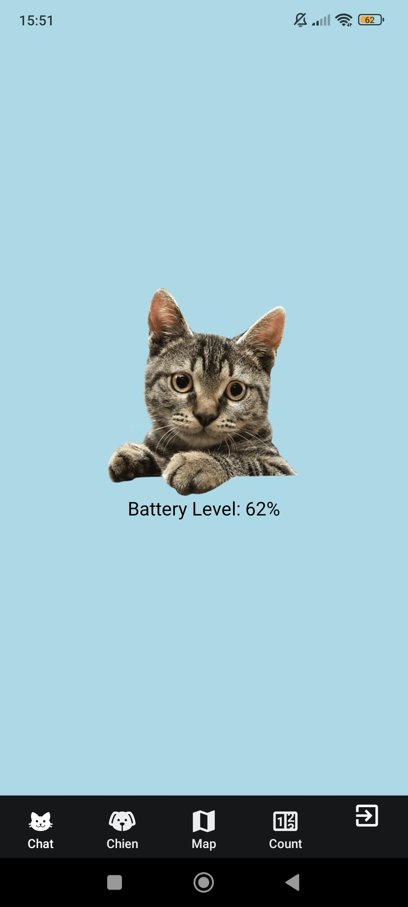
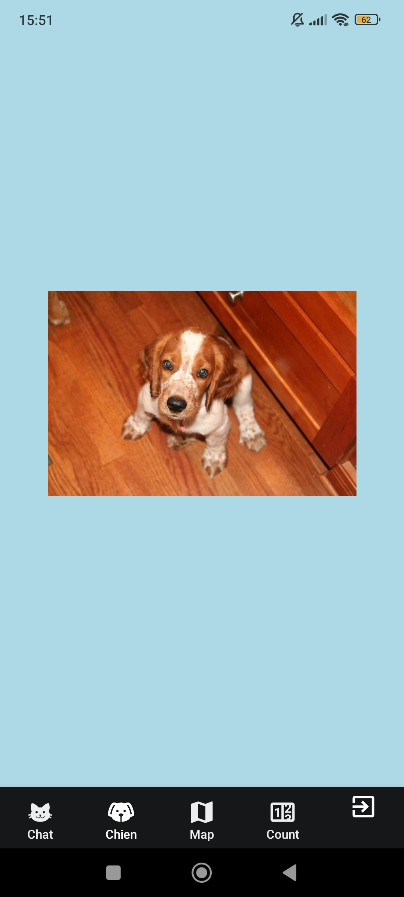
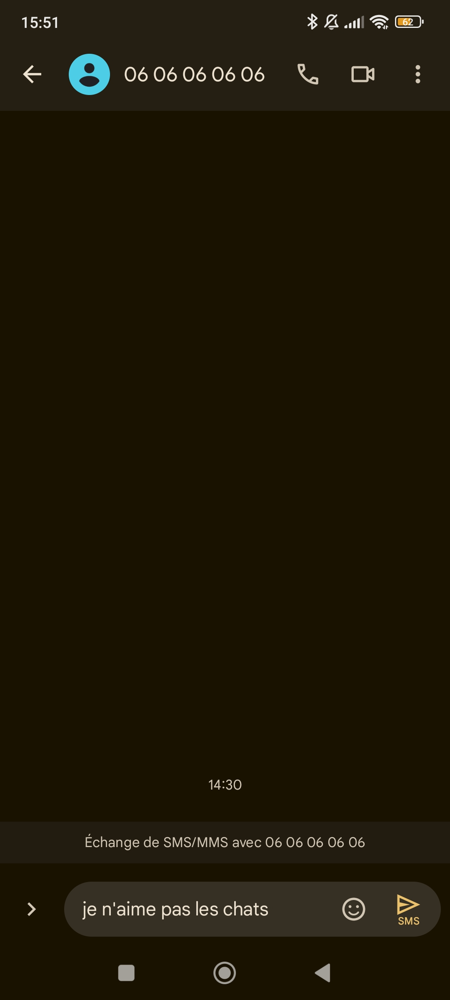
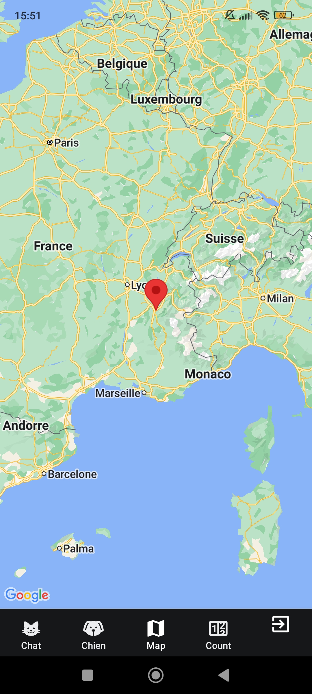
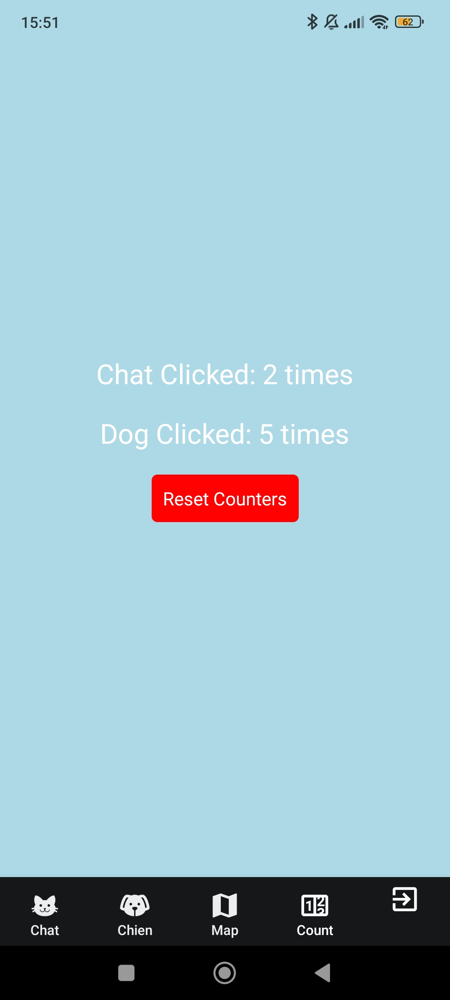

# Application React-Native "Hybrid friend"

## Stack
React-Native, Expo

## Get started

1. Install dependencies

   ```bash
   npm install
   ```

2. Start the app

   ```bash
    npx expo start
   ```

## Description

Lors d'un exam il fallait créer cette application uniquement avec chatGPT 


## Fonctionnalités 

- Splash screen personnalisé 

- La page "Chat" contien l'image d'un chat, lorsque l'utilisateur clique sur cette image, un son de chat est joué
- La page "Chien" contien l'image d'un chien récupéré via une API (image qui change a chaque redémarage de l'app), lorsque l'utilisateur clique sur cette image, un sms est prêt à l'envoi avec comme contenu "Je n'aime pas les chats" avec comme destinataire le 06 06 06 06 06
- La page "Map" nous affiche une map avec notre localisation qui apparaît via un 'marker' rouge
- La page "Count" qui affiche les compteurs chien et chat correspondant au nombre de fois que l'image chat ou chien à été cliqué. Cette donnée est stocké, elle permet de la récupèrer à la prochaine réouverture de l'app.
- Il y a également la possibilité de quitter l'application via le 5 ème logo  de la barre

## Screenshots






